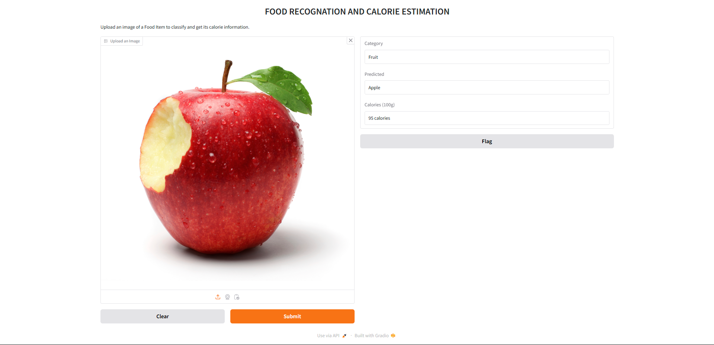

# Food Recognition and Calorie Estimation

## Problem Definition

### 1. Recognition of Diverse Food Items
Recognizing food items accurately even when they vary in presentation, size, or preparation style.

### 2. Calorie Estimation
Integrating a functional calorie estimation module with the food recognition system to provide approximate calorie content.

### 3. Graphical User Interface (GUI)
Developing an intuitive GUI for seamless user interaction.

---

## Proposed Solution
This project focuses on food recognition and calorie estimation via a simple web application that anyone can use. Users can upload an image of a food item, and the system will:

1. Automatically classify the image using the **MobileNetV2** model.
2. Predict the name of the food item accurately.
3. Provide approximate calorie content by scraping relevant nutritional data using **BeautifulSoup**.

The application features a user-friendly **GUI** created with **Gradio**, making it accessible on any browser without requiring technical knowledge.

---

## Tools & Libraries
| **Component**              | **Purpose**                                                      |
|----------------------------|------------------------------------------------------------------|
| **NumPy**                  | Normalization and array processing.                             |
| **Pandas**                 | Data manipulation and processing.                               |
| **TensorFlow/Keras**       | Build, load, and evaluate the MobileNetV2 model for recognition. |
| **Keras ImageDataGenerator** | Preprocess images (rescale, augment, load validation/test data). |
| **Sklearn**                | Metrics evaluation (e.g., classification report, confusion matrix). |
| **BeautifulSoup**          | Web scraping to fetch calorie information.                      |
| **Gradio**                 | Build the GUI for user interaction.                             |
| **PIL (Pillow)**           | Image preprocessing and resizing for model compatibility.       |

---

## Architecture & Workflow

### Architecture
We are using the **MobileNetV2** architecture:
- MobileNetV2 is a convolutional neural network optimized for mobile and lightweight devices.
- It is based on an **inverted residual structure** where residual connections exist between bottleneck layers.
- The architecture supports input sizes greater than **32 x 32**.

Key components of MobileNetV2:
- Two types of blocks: residual blocks and downsizing blocks (stride = 2).
- Each block consists of **three layers**:
   - First: **1x1 convolution** with ReLU6.
   - Second: **Depthwise convolution**.
   - Third: **1x1 convolution** without activation (to avoid losing non-linear output power).

---

### Workflow
The working process of the web application is as follows:
1. **Image Upload**:
   - Users upload an image via the Gradio interface.
   - The image is stored locally.

2. **Preprocessing**:
   - The uploaded image is resized and preprocessed using **Pillow** to match the input shape required by the model.
   - The image is converted into a vector for model input.

3. **Prediction**:
   - The vectorized image is passed to the **MobileNetV2** model.
   - The model classifies the image and predicts the **category label** (e.g., "Apple").

4. **Calorie Estimation**:
   - The predicted label is mapped to an ID.
   - The system uses **BeautifulSoup** to scrape calorie information for the recognized food item.

5. **Display Results**:
   - The system displays the **predicted food name** and the **calorie content** on the application interface.

---

## User Interface
The application features an intuitive **Gradio-based GUI**.
- Users can upload images.
- Results, including the predicted food name and calories, are displayed dynamically.

### Screenshot


---

## Dataset
- Dataset Used: **Fruit and Vegetable Image Recognition Dataset**.

---

## How to Run
1. Clone the repository:
   ```bash
   git clone https://github.com/Shivanshu-Kashyap/Food-Recognition-and-Calorie-Estimation-.git
   cd Food-Recognition-and-Calorie-Estimation
   ```
2. Install the required libraries:
   ```bash
   pip install tensorflow gradio beautifulsoup4 pillow
   ```
3. Run the application:
   ```bash
   python app.py
   ```
4. Open the application in your browser:
   ```
   http://localhost:7860
   ```

---

## Future Scope
- Expand the dataset to include more diverse food items.
- Optimize calorie scraping using a database for faster results.
- Develop a mobile application for on-the-go food recognition.

---

## Credits
- **Model**: MobileNetV2
- **Framework**: TensorFlow/Keras
- **GUI**: Gradio

---

## Contact
For queries, suggestions, or contributions, contact:
- **Name**: Shivanshu Kashyap
- **Email**: shivanshukashyap996@gmail.com

---

## License
This project is licensed under the MIT License.
